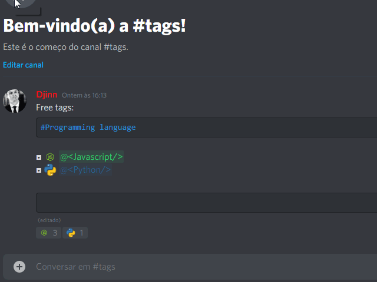
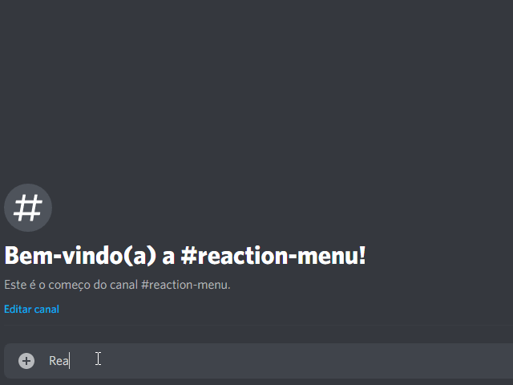
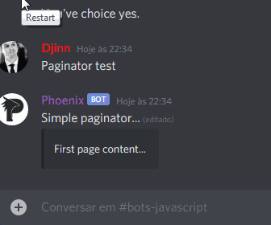
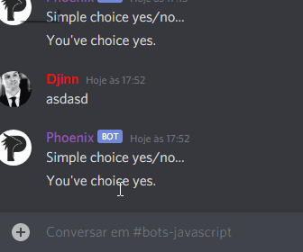
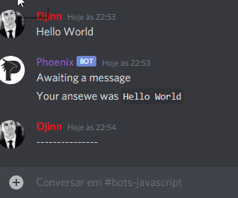
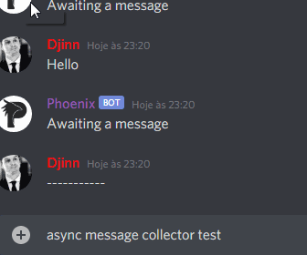

# Discord.js-colelctor

Library to easily create message collector, reactions collector and reactions role on discord.js v12, with customization ways.

---

## Sumary
◘ Reactions Collectors:
| [Reaction Role](#reaction-role)
| [Menu](#reaction-menu)
| [Question](#simple-reaction-collector)
| [Async Question](#simple-boolean-reaction-collector)
| [Embeds Paginator](#embeds-pagination)
◘ Messages Collectors:
| [Question](#simple-messages-collector)
| [Async Question](#async-message-collector)
◘ Examples
| [Reaction Role Manager](./examples/reaction-role-manager/basic.js)
| [Reaction Menu](./examples/reaction-collector/menu.js)
◘ Others
| [Changelog](CHANGELOG.md)

---

## Reaction role

You can create reactions roles, with amazing functions:
| • If you bot turns off, when it turns on all users reacted in messages will win the role.
| • If you bot turns off, if any user remove reaction, when the bot turns on will remove the role from him.
| • You can store the roles in a JSON file and migrate the reaction role data.
| • You can limit max roles given by bot, like 10 roles.



You can find this code example in [Sumary](#sumary)

---

## Reaction menu

To create a reaction menu with multiple pages.



```js
const botMessage = await message.reply('Testing reaction menu...')
ReactionCollector.menu({
  botMessage,
  user: message,
  pages: {
    '✅': {
      content: 'Hello world!',
      reactions: ['?'], // Reactions to acess next sub-page
      embed: {
        description: 'First page content, you can edit and put your custom embed.'
      },
      pages:{ // Exemple sub-pages
        '❓': {
          content: '?',
          embed: {
            description: 'You\'ve found the secret page.'
          }
        }
      }
    },
    '❌': {
      content: 'What\'s happened?',
      embed: {
        description: 'You\'ve clicked in ❌ emoji.'
      }
    }
  }
});
```

### Options param

`ReactionCollector.menu(options);`

```js
{
    botMessage: Message // Message sent from bot.
    user: UserResolvable // User who will react, must be User | Snowflake | Message | GuildMember.
    pages: IMenuPage {// Object with menu pages.
      content?: string; // Message content.
      embed?: {} | MessageEmbed; // Embed, you can use JSON or MessageEmbed.
      reactions?: Array<EmojiResolvable>; // These emojis will use to acess next subpages.
      pages?: IMenuPage; // Recursive pages inside pages.
    } 
    collectorOptions?: ReactionCollectorOptions // Default discord.js collector options.
}
```

## Simple reaction collector

To use in multiple actions, react and then trigger one function to do things.


```js
const { ReactionCollector } = require("discord.js-collector");

const botMessage = await message.channel.send("Simple choice yes/no...");
ReactionCollector.question({
  botMessage,
  user: message,
  onReact: [
    async (botMessage) => await botMessage.channel.send("You've choice yes."),
    async (botMessage) => await botMessage.channel.send("You've choice no."),
  ],
});
```

### Options param

`ReactionCollector.question(options);`

```js
{
    botMessage: Message // Message sent from bot.
    user: UserResolvable // User who will react, must be User | Snowflake | Message | GuildMember.
    collectorOptions?: ReactionCollectorOptions // Default discord.js collector options.
    reactions?: Array<EmojiResolvable> // List of emojis will use to create reaction question.
    onReact?: Array<Function> // When user click on reaction, will trigger respective funcion, in order by reaction list.
    deleteReaction?: boolean // Default true, when user react if it's enabled will remove user reaction.
    deleteAllReactionsWhenCollectorEnd?: boolean // Default true, when collector end, if it's enabled will remove all reactions in botMessage.
}
```

## Simple boolean reaction collector

To use in `if` statements, the asynchronous reaction collector returning Promise <boolean> is more practical



```js
const { ReactionCollector } = require("discord.js-collector");

const botMessage = await message.channel.send("Simple choice yes/no...");
const options = { botMessage, user: message };
if (await ReactionCollector.asyncQuestion(options)) {
  await botMessage.channel.send("You've choice yes.");
} else {
  await botMessage.channel.send("You've choice no.");
}
```

### Options param

`ReactionCollector.asyncQuestion(options);`

```js
{
    botMessage: Message // Message sent from bot.
    user: UserResolvable // User who will react, must be User | Snowflake | Message | GuildMember.
    collectorOptions?: ReactionCollectorOptions // Default discord.js collector options.
    reactions?: Array<EmojiResolvable> // Max 2 emojis - List of emojis will use to create reaction question.
    deleteReaction?: boolean // Default true, when user react if it's enabled will remove user reaction.
    deleteAllReactionsWhenCollectorEnd?: boolean // Default true, when collector end, if it's enabled will remove all reactions in botMessage.
}
```

## Embeds pagination

Easier paginator embeds, with back/skip reaction to change current page.



```js
const { ReactionCollector } = require("discord.js-collector");

const botMessage = await message.channel.send("Simple paginator...");
ReactionCollector.paginator({
  botMessage,
  user: message,
  pages: [
    new MessageEmbed({ description: "First page content..." }),
    new MessageEmbed({ description: "Second page content..." }),
  ],
});
```

### Options param

`ReactionCollector.paginator(options);`

```js
{
    botMessage: Message // Message sent from bot.
    user: UserResolvable // User who will react, must be User | Snowflake | Message | GuildMember.
    collectorOptions?: ReactionCollectorOptions // Default discord.js collector options.
    reactions?: Array<EmojiResolvable> // List of emojis will use to create reaction question. First emoji will be use to back page, second to skip page.
    deleteReaction?: boolean // Default true, when user react if it's enabled will remove user reaction.
    deleteAllReactionsWhenCollectorEnd?: boolean // Default true, when collector end, if it's enabled will remove all reactions in botMessage.
}
```

---

## Simple messages collector

Await for messages from user, and when it's send will fire a trigger to do things.



```js
const { MessageCollector } = require("discord.js-collector");

const botMessage = await message.channel.send("Awaiting a message");
MessageCollector.question({
  botMessage,
  user: message.author.id,
  onMessage: async (botMessage, message) =>
    await botMessage.channel.send(`Your answer was ${message.content}`),
});
```

### Options param

`MessageCollector.question(options);`

```js
{
    botMessage: Message // Message sent from bot.
    user: UserResolvable // User who will react, must be User | Snowflake | Message | GuildMember.
    collectorOptions?: MessageCollectorOptions // Default discord.js collector options.
    onMessage?: async(botMessage, message) => {} // Trigger fired when user send a message.
    deleteMessage?: boolean // Default true, when user send a message if it's enabled will delete it.
}
```

## Async message collector

Await for message from user, and when user send, will return user message as Promise<Message>.



```js
const { MessageCollector } = require("discord.js-collector");

const botMessage = await message.channel.send("Awaiting a message");
const userMessage = await MessageCollector.asyncQuestion({
  botMessage,
  user: message.author.id,
});
if (userMessage.content === "ping") {
  await message.channel.send("pong!");
}
```

### Options param

`MessageCollector.asyncQuestion(options);`

```js
{
    botMessage: Message // Message sent from bot.
    user: UserResolvable // User who will react, must be User | Snowflake | Message | GuildMember.
    collectorOptions?: MessageCollectorOptions // Default discord.js collector options.
    deleteMessage?: boolean // Default true, when user send a message if it's enabled will delete it.
}
```
