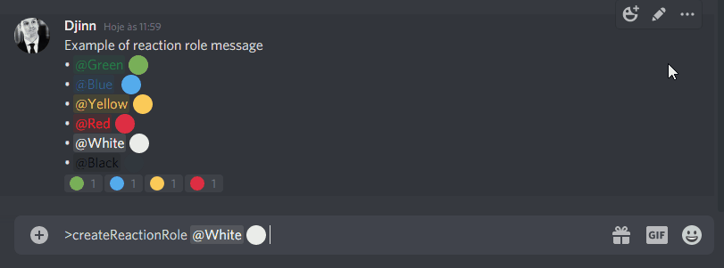

# Discord.js-collector

Library to easily create message collector, reactions collector and reactions role on discord.js v12, with customization ways.

---

## Sumary
◘ Reactions Collectors:\
| [Reaction Role](#reaction-role)\
| [Menu](#reaction-menu)\
| [Question](#simple-reaction-collector)\
| [Yes/No Question](#simple-boolean-reaction-collector)\
| [Embeds Paginator](#embeds-pagination)\
◘ Messages Collectors:\
| [Question](#simple-messages-collector)\
| [Async Question](#async-message-collector)\
◘ Examples\
| [Reaction Role Manager](./examples/reaction-role-manager/basic.js)\
| [Reaction Menu](./examples/reaction-collector/menu.js)\
◘ Others\
| [Changelog](CHANGELOG.md)


## Documentation

See all documentation [here](https://idjinn.github.io/)

---

## Reaction role

You can create reactions roles, with amazing functions:\
| • If you bot turns off, when it turns on all users reacted in messages will win the role.\
| • If you bot turns off, if any user remove reaction, when the bot turns on will remove the role from him.\
| • You can store the roles in a JSON file and migrate the reaction role data.\
| • You can limit max roles given by bot, like 10 roles.\
| • Toggled roles: Limit one of these roles to use (Util for colors reaction roles, only get one of roles)\
| • Requirements: Limit roles to only boosters or discord developers win roles!



You can find this code example [here](./examples/reaction-role-manager/basic.js)

---

## Reaction menu

To create a reaction menu with multiple pages.


```js
const botMessage = await message.reply('Testing reaction menu...')
ReactionCollector.menu({
  botMessage,
  user: message,
  pages: {
    '✅': {
      content: 'Hello world!',
      reactions: ['?'], // Reactions to acess next sub-page
      embed: {
        description: 'First page content, you can edit and put your custom embed.'
      },
      pages:{ // Exemple sub-pages
        '❓': {
          content: '?',
          embed: {
            description: 'You\'ve found the secret page.'
          }
        }
      }
    },
    '❌': {
      content: 'What\'s happened?',
      embed: {
        description: 'You\'ve clicked in ❌ emoji.'
      }
    }
  }
});
```

## Simple reaction collector

To use in multiple actions, react and then trigger one function to do things.


## Simple boolean reaction collector

To use in `if` statements, the asynchronous reaction collector returning Promise <boolean> is more practical


## Embeds pagination
Example [here](./examples/reaction-collector/paginator.js)

Easier paginator embeds, with back/skip reaction to change current page.


```js
const { ReactionCollector } = require("discord.js-collector");

const botMessage = await message.channel.send("Simple paginator...");
ReactionCollector.paginator({
  botMessage,
  user: message,
  pages: [
    new MessageEmbed({ description: "First page content..." }),
    new MessageEmbed({ description: "Second page content..." }),
  ],
});
```

## Simple messages collector

Await for messages from user, and when it's send will fire a trigger to do things. See exemple [here](https://github.com/IDjinn/Discord.js-Collector/tree/master/examples/message-collector/question.js) 


## Async message collector

Await for message from user, and when user send, will return user message as Promise<Message>.


```js
const { MessageCollector } = require("discord.js-collector");

const botMessage = await message.channel.send("Awaiting a message");
const userMessage = await MessageCollector.asyncQuestion({
  botMessage,
  user: message.author.id,
});
if (userMessage.content === "ping") {
  await message.channel.send("pong!");
}
```
